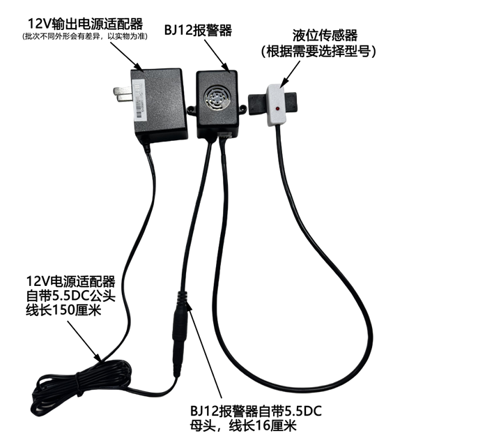
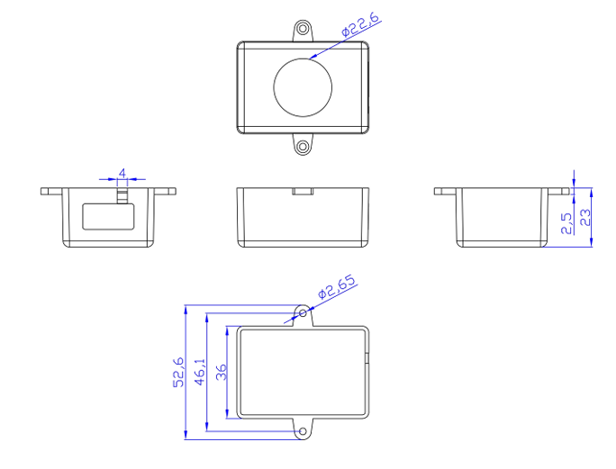
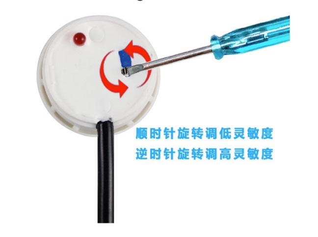

# KT0314-KT0315-KT0316-KT0317

## 一、产品概述: 

本报警器主要与液位传感器配合使用，用于监测液体容器的液位情况。当检测到容器内液位超出设定值时， 报警器会立即发出警报，以提醒用户及时采取措施，防止设备损坏或财物受损。

## 二、产品选型 :

| 型号 | 液位传感器输出接口 | 报警条件         |
| :--: | :----------------: | ---------------- |
| BJ12 |    高低电平输出    | 无液报警（常闭） |
| BJ12 |      NPN输出       | 有液报警（常开） |

备注：由于报警器的接口为DC接头，故可以搭配不同规格的电源适配器进行出货，例如：ENEC（欧洲）， NEC（美洲）；如有需要请按规格进行下单。

## 三、产品特性:

1.高灵敏度：采用先进的液位传感器，能够实时监测液位变化。 

2.及时报警：当容器内液位超出设定值时，报警器会立即发出警报。 

3.简单易用：无需复杂的设置，接上电源和液位传感器即可使用。 

4.可靠性高：采用高品质的材料和先进的生产工艺，确保产品的稳定性和耐用性。

## 四、产品参数:

|   项目名称   |              参数              |      |
| :----------: | :----------------------------: | :--: |
|  电源适配器  | 输入：AC110V~220V；输出：DC12V |      |
|   报警功耗   |             小于1W             |      |
|   待机功耗   |          同液位传感器          |      |
|   响应时间   |          同液位传感器          |      |
|  感应灵敏度  |          同液位传感器          |      |
|   报警方式   |            声音报警            |      |
| 工作环境温度 |            -20~105℃            |      |
| 工作环境湿度 |            5%~100%             |      |

## 五、产品外观及各部件说明:

## 六、BJ12报警器尺寸图：

## 七、使用说明:

1.将电源适配器DC头BJ12报警器DC头对插。 

2.将电源适配器插在AC110V~220V电源插座上。 

3.将液位传感器XH2.54-4P端子插入BJ12报警器对应插口。 

4.将各部件固定好，设置好液位传感器。（液位传感器的安装和设置见对应的传感器说明书） 

5.接通电源，测试预设的液位阈值下，报警器自动发出报警声音。

## 八、产品其他注意事项:

（一）注意保持产品的清洁，尽量做到防腐蚀及避免受到其它物体的剧烈碰撞﹑打击。 

（二）室外安装时应避免阳光直射和雨水直打流到产品上，并远离高热源并注意通风，若环境温度超出额定温度 时，应采取相应的降温保护措施。 

（三）环境温度过低于产品正常工作温度范围时，可采用仪表保护箱或其它的防护雨帽装置进行防冻保护，并注 意保持产品的干燥。 （四）若长时间不使用报警器，请关闭电源 。

（五）定期检查报警器的电源线和信号线是否完好，如有破损请及时更换。（检测时间间隔由使用单位根据具体 情况确定）。
